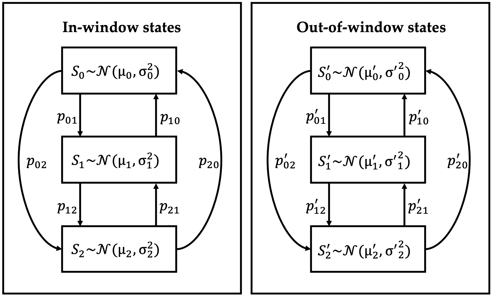
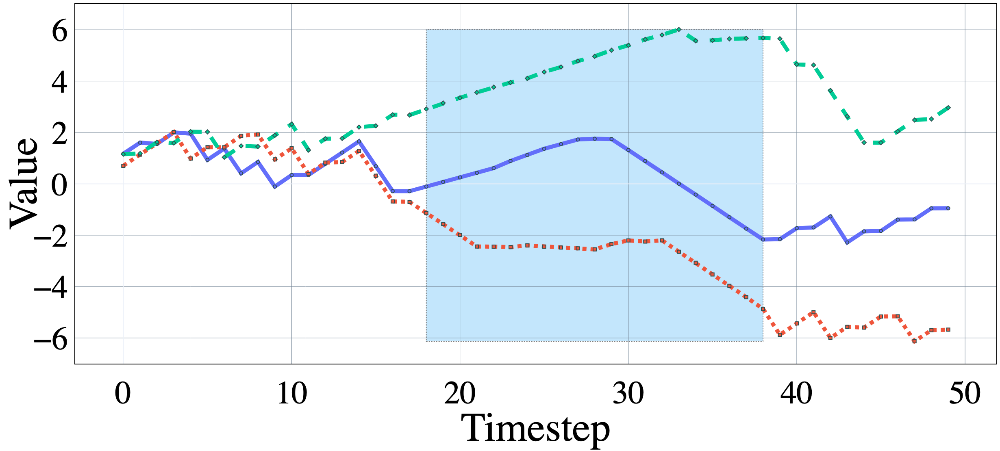

======
synmod
======

.. image:: https://travis-ci.com/cloudbopper/synmod.svg?branch=master
    :target: https://travis-ci.com/cloudbopper/synmod
    :alt: Build Status

.. image:: https://readthedocs.org/projects/synmod/badge/?version=latest
    :target: https://synmod.readthedocs.io/en/latest/?badge=latest
    :alt: Documentation Status

``synmod`` is a Python library to generate synthetic time-series data and models.
Given the input configuration (the number of instances, number of features and sequence
length),
it randomly samples feature types and generators, and uses these to generate time-series data.
It also partitions the set of features into relevant and irrelevant, selects
temporal windows for each feature, and uses these to create a function representing
a time-series model.

``synmod`` is developed to
support anamod_, a Python library implementing algorithms designed
to analyze feature importance of black-box models.

.. _anamod: https://github.com/cloudbopper/anamod

------------------
Feature Generation
------------------

We randomly sample a mixture of discrete and continuous features, and for each feature, we randomly
sample sequence generators based on Bernoulli processes (binary features only) and Markov chains
(binary/categorical/continuous features). Each feature is associated with a randomly selected window,
so that the generating process within the window is different from that outside the window.
For some continuous features, sampled values are accumulated so as to model trends, i.e.
contiguous time periods where the value of the feature increases, decreases or
stays nearly constant, so that the ordering of values becomes significant.

    Markov chain generator for a continuous feature. A window (i.e. subsequence)
    is randomly selected for the feature. The sequence
    for a given instance is generated via a random walk through the
    chain. Different chains are used for in-window and out-of-window
    timestamps. Each state is associated with a Gaussian distribution, and the
    sampled value determines the value of the feature at a given timestep. The
    number of states per generator, state distributions and transition
    probabilities are randomly chosen.

    Three generated time series for a feature using such a generator. In this
    example, the value sampled for the feature at a given timestep is used to
    increment the value of the feature to generate trends.

---------------
Synthetic Model
---------------

**[If you're opening this page on Github, see https://synmod.readthedocs.io/en/latest/readme.html for properly rendered LaTeX.]**

We create a two-level function over the features. We first partition the set of
features into *relevant* and *irrelevant*. For each feature :math:`j`, we sample a function :math:`g_j`
(average/max/slope) that aggregates the values within the window :math:`[k_1, k_2]` of that feature:

.. math::

    \bar{x}_j^{(i)} = g_j \left( x_{j, k_1} \ldots x_{j, k_2} \right)

We then take a linear combination of the aggregated values of relevant features :math:`\mathcal{R}`
to represent the *ground-truth model* :

.. math::

    y^{(i)} = \sum\limits_{j \in \mathcal{R}} \alpha_j \bar{x}_j^{(i)}

We also create an *approximate model* :math:`f \left( \mathbf{X} \right)` that includes the
irrelevant features :math:`\mathcal{I}`:

.. math::

    f \left( \mathbf{X}^{(i)} \right) = \sum\limits_{j \in \mathcal{R}} \alpha_j \bar{x}_j^{(i)} + \beta \sum\limits_{j \in \mathcal{I}} \alpha_j \bar{x}_j^{(i)}

For the purpose of downstream analysis, the ground-truth model serves to generate labels over the data,
and the approximate model represents the time-series model being analyzed.

------------
Installation
------------

To install synmod from github::

    pip install synmod@git+https://github.com/cloudbopper/synmod

-----
Usage
-----

``synmod`` may be invoked from within Python (detailed usage documentation forthcoming), or from the command-line as follows::

    python -m synmod -num_instances 100 -num_features 10 -sequence_length 20 -output_dir out1 -write_outputs 1

``synmod`` also supports other configuration options, including different model types (classifier vs. regression),
static (i.e. non-temporal) models, fraction of features chosen to be relevant, and interaction terms.
Run ``python -m synmod -h`` to see a full list of options.

-------
License
-------

``synmod`` is free, open source software, released under the MIT license. See LICENSE_ for details.

.. _LICENSE: https://github.com/cloudbopper/synmod/blob/master/LICENSE

-------
Contact
-------

`Akshay Sood`_

.. _Akshay Sood: https://github.com/cloudbopper
